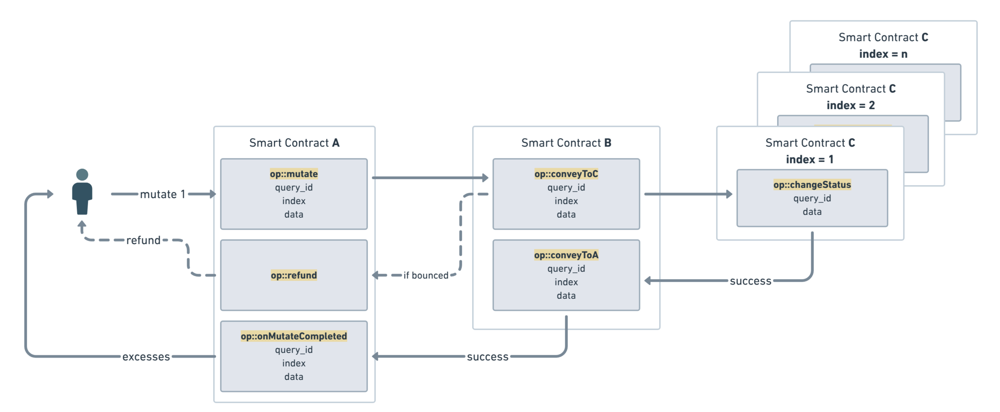

# Registry of Trust: Leveraging Collection Contracts for Secure Delegation in TON

In decentralized applications, maintaining security and efficient state management is paramount. 
This article presents a design used on the TON blockchain that employs a collection contract 
to mediate interactions between a main contract (A) and a set of deployed item contracts (C) 
via an intermediary (B). 
This structure enforces secure delegation while avoiding unbounded state growth in any single contract.
---
## Overview of the Architecture
The architecture involves three primary components:
- **Main Contract** (A): The primary authority that issues commands.
- **Collection Contract** (B): Acts as the secure registry and intermediary. 
It indexes and manages deployed item contracts and routes messages without maintaining an unbounded map.
- **Item Contracts** (C): The contracts deployed via B that perform specific operations. 
These items never interact directly with A.

## How the Delegation Works
When a message needs to be conveyed between A and C (or other way around), 
it is always routed through the collection contract (B). 
Below are two key functions from the collection contract used to forward messages securely.

### 1. Conveying from an Item Contract (C) to the Main Contract (A)

```
;; Forwards any message received from an item contract to the main contract with security checks
() conveyToA(slice sender_address, slice msg_body, int query_id) impure inline {
    ;; parse the message body
    var (index, method, data) = (msg_body~load_uint(50), msg_body~load_uint(32), msg_body~load_ref());
    ;; load the storage
    var per_ds = get_data().begin_parse();
    var (a_address, next_index, item_code) = (
        per_ds~load_msg_addr(), ;; a_address
        per_ds~load_uint(50), ;; next_item_index
        per_ds~load_ref() ;; nft_item_code
    );
    ;; Ensure the provided index is within the known range. This prevents any deployment with a higher index than expected.
    throw_unless(error::wrong_item_index(), next_index > index);
    ;; Re-calculate the expected address for the item contract based on its index and code
    slice item_address = calculate_item_address(workchain(), calculate_item_state_init(index, item_code));
    ;; Verify that the sender's address matches the expected item address
    throw_unless(error::wrong_sender(), equal_slice_bits(sender_address, item_address));
    ;; Send the message to the A contract
    send_raw_message(begin_cell()
        .store_uint(0x18, 6)
        .store_slice(a_address)
        .store_coins(0)
        .store_uint(0, 1 + 4 + 4 + 64 + 32 + 1)
        .store_uint(1, 1)             ;; body is a reference  
        .store_ref(begin_cell()
            .store_uint(method, 32)   ;; op
            .store_uint(query_id, 64) ;; query_id
            .store_ref(data)          ;; body to convey
            .end_cell())
        .end_cell(), 
        64);
}
```

#### Explanation
- The function extracts an index, method, and data from the incoming message slice.
- It validates that the provided index is lower than the current next_index. 
> This is rather an optional check - an item contract must ensure only collection contract can deploy it.
- The expected item contract address is re-calculated using deterministic functions (based on the deployment parameters and index).
- A check confirms that the sender’s address matches the calculated address, preventing spoofing.
- If all validations pass, the message is forwarded to the main contract (A)
- Outbound message has same query_id for tracing

### 2. Conveying from the Main Contract (A) to an Item Contract (C)
```
;; Forwards a message from the main contract to an item contract based on its index
() conveyToC(slice sender_address, slice msg_body, int query_id) impure inline {
    ;; parse the message body
    var (index, method, data) = (msg_body~load_uint(50), msg_body~load_uint(32), msg_body~load_ref());
    ;; load the storage
    var per_ds = get_data().begin_parse();
    var (a_address, next_index, item_code) = (
        per_ds~load_msg_addr(), ;; a_address
        per_ds~load_uint(50), ;; next_item_index
        per_ds~load_ref() ;; nft_item_code
    );
    ;; Ensure the message originated from the main contract
    throw_unless(error::wrong_sender(), equal_slice_bits(a_address, sender_address));
    ;; Validate that the index is within the known range
    throw_unless(error::wrong_item_index(), next_index > index);
    ;; Compute the expected address for the item contract
    slice item_address = calculate_item_address(workchain(),
        calculate_item_state_init(index, item_code));
    ;; Forward the message to the item contract
    send_raw_message(begin_cell()
        .store_uint(0x18, 6)
        .store_slice(item_address)
        .store_coins(0)
        .store_uint(0, 1 + 4 + 4 + 64 + 32 + 1)
        .store_uint(1, 1)             ;; body is a reference  
        .store_ref(begin_cell()
            .store_uint(method, 32)   ;; op
            .store_uint(query_id, 64) ;; query_id
            .store_ref(data)          ;; body to convey
            .end_cell())
        .end_cell(),
        64);
}
```

#### Explanation
- The function confirms that the message is indeed sent by the main contract.
- After extracting the index, method, and data, it verifies that the index is valid.
- The item contract’s address is computed in the same manner as before.
- The message is then relayed to the appropriate item contract.

## Message Reception and Routing
The main entry point for inbound messages in the collection contract is the recv_internal function. It handles messages as follows:

```
() recv_internal(cell in_msg_full, slice in_msg_body) impure {
    if (in_msg_body.slice_empty?()) {
        return ();
    }
    slice cs = in_msg_full.begin_parse();
    int flags = cs~load_uint(4);
    slice sender_address = cs~load_msg_addr();

    if (flags & 1) {
        var per_ds = get_data().begin_parse();
        slice a_address = per_ds~load_msg_addr();
        ;; If the message bounces (usually, due to a call to a non-existent item),
        ;; forward a callback to the main contract so it could decide what to do with the funds.
        send_raw_message(begin_cell()
            .store_uint(0x18, 6)
            .store_slice(a_address)
            .store_coins(0)
            .store_uint(0, 1 + 4 + 4 + 64 + 32 + 1 + 1)
            .store_ref(begin_cell()
                .store_uint(op::excesses(), 32)   ;; op
                .store_uint(0, 64)
                .end_cell())
            .end_cell(),
            64);
        return ();
    }
    int op = in_msg_body~load_uint(32);
    int query_id = in_msg_body~load_uint(64);
    
    ;; if (op == op::mintAnItem()) implementation is ommitted
    
    if (op == op::conveyToA()) {
        conveyToA(sender_address, in_msg_body, query_id);
        return();
    }
    if (op == op::conveyToC()) {
        conveyToC(sender_address, in_msg_body, query_id);
        return();
    }
    throw(error::unrecognized_op());
}
```

## Visualization


## Security Analysis

### Preventing Replay Attacks
- **External vs. On-Chain Messages**: Replay attacks are a concern primarily for external messages. Internal messages are immune to replays.
- **Index Validation**: Only messages with valid, already-deployed indices are accepted.
- **Deterministic Address Calculation**: Mismatched parameters are detected immediately.

### Preventing Spoofing Attacks
- **Sender Address Verification**: Senders are rigorously authenticated.
- **Immediate Error Handling**: Mismatches trigger immediate errors.


## Conclusion
The design presented here leverages a collection contract as a "Registry of Trust" to enable secure delegation between smart 
contracts on TON. By enforcing strict index bounds, recalculating expected addresses, 
and performing on-chain validations, this architecture effectively mitigates replay and spoofing attacks. 
Routing all communications through the collection contract ensures scalability and security, 
while bounce logic guarantees fund recovery in error scenarios. 
This blueprint is a robust foundation for modular, secure dApps on TON.
